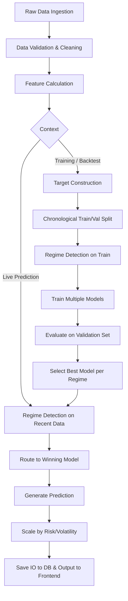

# Model Selection and Prediction Flow

This document details the complete end-to-end flow from data ingestion to final prediction and model selection.

## 1. Flowchart: End-to-End Prediction Process

## 2. Process Breakdown

### A. Data Ingestion & Validation
- Live or historical OHLCV data is loaded. Missing values are filled, and invalid price constraints are handled implicitly by Pandas `dropna()` after feature calculations.

### B. Feature Calculation
- Technical indicators (RSI, MACD, Bollinger Bands) and temporal features are computed for time $t$.
- **Crucial Rule:** We predict $t+1$ returns using information strictly available at time $t$. No future data leaks into the feature space.

### C. Target Construction
- `target_pct_return = (Close[t+1] - Close[t]) / Close[t]`
- Classification labels (`strong_up`, `neutral`, `strong_down`) are dynamically constructed using a trailing rolling standard deviation threshold.

### D. Training and Validation
- **Chronological Split:** The training data is split (80% train, 20% validation) strictly by time.
- **Regime specific:** Models are trained separately on data subsets belonging to Bull, Bear, and HighVol regimes.

### E. Model Evaluation
- Regression models compute price errors (MAE, MSE, RMSE, MAPE) and trading returns.
- Classification models compute Accuracy, F1, ROC-AUC, and trading returns.
- All scores are logged to PostgreSQL via `ModelScorecard`.

### F. Model Selection
- The `AdaptiveRouter` compares the Sharpe Ratio produced by the best Regression model vs. the best Classification model on the validation set, independently for each regime.
- The model paradigm with the highest Sharpe Ratio is designated the "winner" for that regime.

### G. Prediction Generation
- The latest row of features is extracted.
- The current regime is identified.
- The `AdaptiveRouter` forwards the features to the corresponding winning model.
- If it's a regression model, it predicts a percentage return and infers a target price. If classification, it predicts a direction.
- The final output signal is sized based on recent inverse volatility to maintain risk targets.
