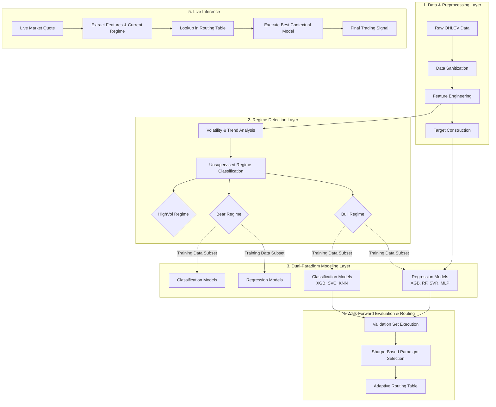
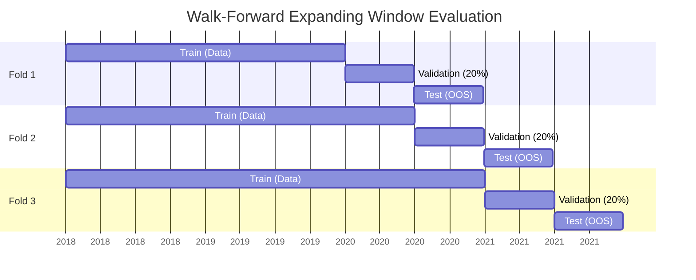

# Stocker: Adaptive Regime-Aware Machine Learning for Financial Time Series Forecasting
**Research Paper Blueprint & Methodology**

This document serves as a comprehensive structural and methodological foundation for writing a research paper based on the Stocker prediction system.

---

## 1. Abstract (Outline)
- **Problem Context:** Financial markets are highly non-stationary and noisy, rendering static predictive models ineffective across varying market conditions (regimes).
- **Proposed Solution:** "Stocker" is an adaptive, regime-aware machine learning pipeline. It autonomously categorizes market conditions into regimes (Bull, Bear, High Volatility) and dynamically routes predictions to the historically most robust predictive paradigm (Regression vs. Classification).
- **Methodology Highlights:** The system implements an expanding walk-forward chronological cross-validation strategy to entirely eliminate look-ahead bias, evaluating models strictly on out-of-sample metrics (Sharpe Ratio, MAPE, ROC-AUC).
- **Expected Results/Contribution:** Demonstrates that adaptive switching between directional classification and precise return regression—conditioned on unsupervised regime detection—yields superior risk-adjusted returns (Sharpe) compared to static models and naive buy-and-hold benchmarks.

---

## 2. Proposed System Architecture (Block Diagram)

---

## 3. Data Collection and Feature Engineering Methodology

### 3.1 Data Scope
- **Universe:** Select high-liquidity stocks from the National Stock Exchange of India (NSE).
- **Frequency:** Daily closing intervals ($t$). 

### 3.2 Feature Vector ($X_t$)
To enforce strictly causal inference, all features at time $t$ rely only on data up to $t$.
- **Momentum:** RSI (14-period), MACD (12, 26, 9 EMA).
- **Volatility:** Bollinger Band width, Rolling standard deviation.
- **Volume Dynamics:** Ratio of current volume to 10-period trailing mean.
- **Temporal Dimensions:** Cyclical encodings of day-of-week and month.
- **Autoregression:** Lagged variables of past closing sequences.

### 3.3 Target Variable ($Y_{t+1}$)
The model predicts the $t+1$ horizon based on $X_t$.
- **Regression Target:** $Y_{reg} = \frac{C_{t+1} - C_t}{C_t}$
- **Classification Target:** Discrete classes $Y_{cls} \in \{ -1, 0, 1 \}$ based on rolling volatility thresholds (e.g., Return > 0.5 * $\sigma_t$ = Strong Up).

---

## 4. Regime Detection & Contextual Partitioning
Financial time series exhibit heteroskedasticity. A model optimized for low-volatility uptrends typically degrades during rapid sell-offs.

**Workflow:**
1. Calculate trailing 60-day returns and volatility.
2. Segment the feature space $X$ into subsets:
   - **Bull:** High positive drift, low-to-medium volatility.
   - **Bear:** Negative drift, medium-to-high volatility.
   - **HighVol:** Absolute drift irrelevant, extreme variance.
3. Separate training spaces are instantiated for each regime subset.

---

## 5. Walk-Forward Cross-Validation (WF-CV)
Standard $k$-fold cross-validation is invalid for financial data due to temporal leakage. 

- **Validation Set Purpose:** The final 20% of the training block is used purely to simulate strategy returns and execute **Model Selection**.
- **Test Set Purpose:** Never seen by the model or the routing algorithm until the final out-of-sample (OOS) audit.

---

## 6. The Adaptive Routing Engine (Core Contribution)
The primary algorithmic contribution is the **Adaptive Router**. Instead of asserting that regression or classification is fundamentally superior, Stocker mathematically derives the optimal paradigm per regime.

**Algorithm:**
1. For Regime $R_i$, Train Regression Set $\mathcal{M}_{reg}$ and Classification Set $\mathcal{M}_{cls}$.
2. Evaluate all $m \in \mathcal{M}_{reg} \cup \mathcal{M}_{cls}$ on the validation hold-out.
3. Compute simulated trading returns and derive the Validation Sharpe Ratio ($SR_v$).
4. Selection Rule:
   $$ Model_{R_i}^* = \text{argmax}_{m} SR_v(m) $$
5. The winning paradigm/hyperparameters are locked into the Routing Table.

---

## 7. Mathematical Evaluation Framework

### 7.1 Statistical Metrics
To prove the model's predictive validity before applying trading heuristics:
- **Mean Absolute Percentage Error (MAPE):** Evaluates regression precision invariant of stock unit price.
- **Root Mean Squared Error (RMSE):** Strongly penalizes outliers in price predictions.
- **ROC-AUC (Classification):** Evaluates probabilistic ranking capacity across multi-class predictions, ensuring the model is not merely outputting the majority class.

### 7.2 Financial Simulation (Backtesting)
The true test of a financial model is its equity curve post-transaction costs ($c$).
- **Strategy Return:** $R_s = \sum_{t=1}^{T} (S_t \times R_t) - c$
- **Sharpe Ratio:** 
  $$ SR = \frac{E[R_s - R_f]}{\sigma_{R_s}} \sqrt{252} $$
- **Maximum Drawdown (MDD):** Proves risk mitigation compared to passive holding.

---

## 8. Expected Experimental Results for the Paper
When drafting the results section, structure it as follows:
1. **Regime Distribution:** Show how the NSE index data fell into Bull vs Bear regimes over the last 10 years.
2. **Model Paradigm Dominance:** Present a table showing *which* models won in *which* regimes (e.g., Did Classification outperform in Bear markets due to noise reduction? Did Regression dominate Bull markets?).
3. **Out-of-Sample OOS Performance:** Plot the cumulative equity curve of the Adaptive Strategy vs. Static Regression, Static Classification, and Buy-and-Hold.
4. **Risk Profile:** Show that while the Adaptive model may not beat the absolute return of Buy-and-Hold in a raging bull market, its Max Drawdown is significantly lower, resulting in a substantially higher Sharpe Ratio.
